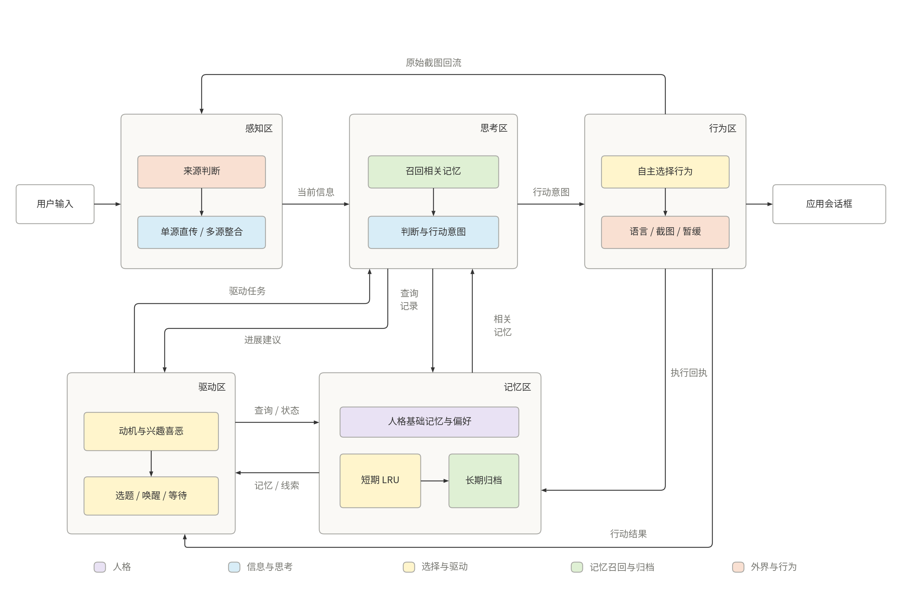

# Weave

一组由感知、思考、行为、记忆和驱动五个区组成的自主对话 Agent。

第一期目标：先通过人格设定明确基础记忆、兴趣与喜恶；配置完成后，即使没有用户聊天输入，也能自主选择具体话题并发起交流。

[阅读完整的一期设计方案](docs/design-v1.md)



当前交付为方案设计，包含五区职责、人格初始化、主动开题、事件与记忆协议、DeepSeek 接入、运行参数及 21 项验收用例。应用运行验证尚未执行。

图示参考 DeepSeek V4.1 Flash 技术报告图 3、图 4 的视觉表达，内容为本方案设计。PNG 用于直接阅读，SVG 用于缩放和导出，绘图源码位于 [tools/render_diagrams.py](tools/render_diagrams.py)。

重新生成图示需要 Python、Matplotlib 和中文字体：

```sh
python3 tools/render_diagrams.py
```

脚本自动寻找常见系统中文字体，也可通过 `WEAVE_CJK_FONT` 指定字体文件。生成时检查连线交叉、重叠、节点遮挡和文字越界；结果保存到 [diagram-checks.json](docs/assets/diagram-checks.json)。
