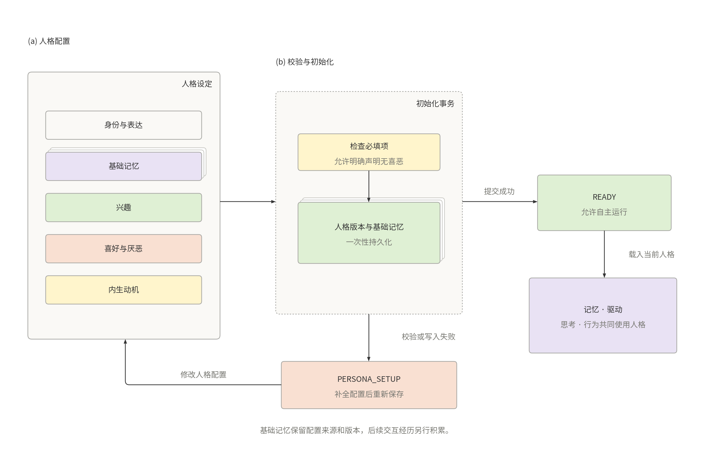
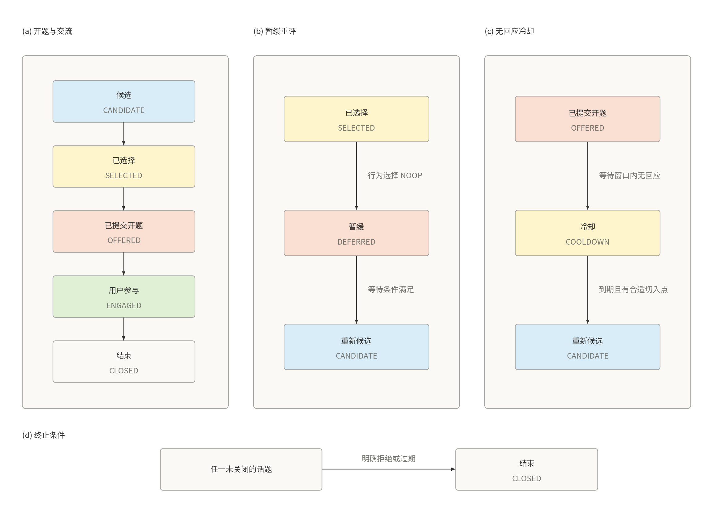
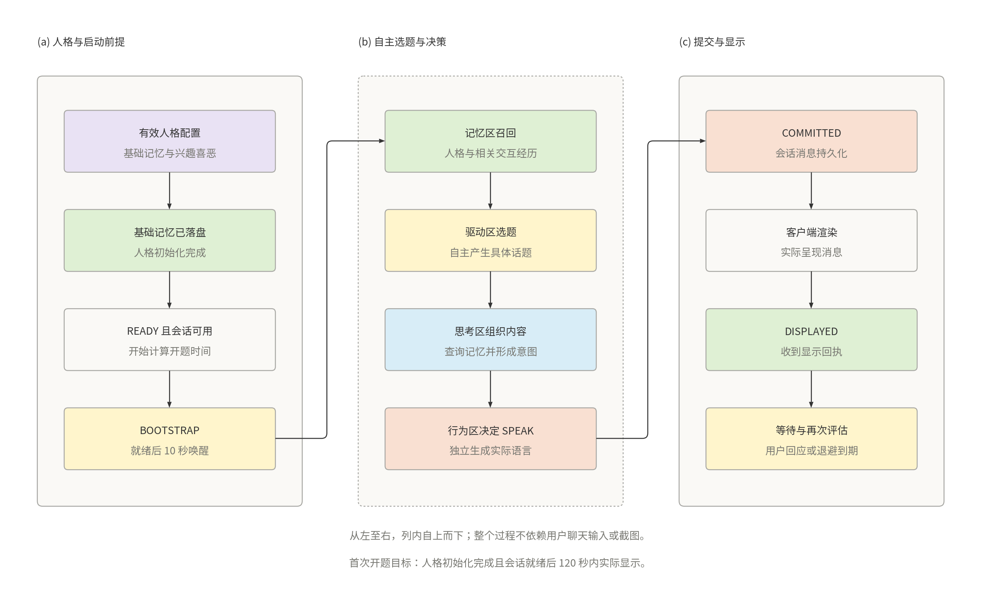

# 自主对话 Agent 集第一期设计方案

版本：V1.0；日期：2026 年 9 月 30 日。

状态：方案设计，供实现和验收使用；运行验证尚未执行。

适用读者：产品设计、Agent 开发、客户端开发及测试人员。

本方案设计一组由感知区、思考区、行为区、记忆区和驱动区组成的 Agent。首次启动必须先完成人格设定，明确基础记忆、兴趣、喜好和厌恶，并完成持久化。第一期的核心结果是：完成上述配置后，即使用户没有发送聊天消息、没有预先指定任务、也没有交互经历，系统仍能依据人格和记忆自行选择具体话题，主动输出到会话框；用户回应后能够继续交流。

记忆区提供经历、偏好、未解决问题和新线索，驱动区结合基础动机决定何时关注什么，思考区形成内容与行动意图，行为区最终判断是否说话及说什么。定时器负责提供唤醒机会，话题和语言由模型根据当前状态产生。

文中架构、时间参数和验收阈值属于本项目的设计选择。模型能力依据官方文档核对；这些资料不代表本应用已经完成接入或运行验证。

## 1 第一期目标与范围

### 1.1 核心使用场景

用户先完成人格设置，再进入会话框，此后不输入聊天文字。系统在允许主动交流的条件下，自主生成一个有具体内容、可以自然接话的话题。例如提出一个生活中的小观察、一个轻量思考问题，或者围绕过去明确交流过的兴趣继续展开。

第一期同时覆盖三种没有新输入的状态：已有人格基础记忆但尚无交互经历的冷启动；已有交流历史后的安静时段；主动开题后用户没有回应。后两种状态具有不同的等待节奏，不能全部按冷启动处理。

“没有输入”指没有新的用户聊天消息，不包含首次必须完成的人格配置。主动开题不能依赖先收到一次用户聊天消息；截图也不是开题的必要前置条件。即使截图不可用，仍可根据人格规定的兴趣喜恶和基础记忆完成主动交流。

### 1.2 必须实现的能力

- FR00 人格初始化：首次启动先设定基础记忆、兴趣、喜好和厌恶；校验与落盘完成后才进入自主运行。
- FR01 自主开题：已完成人格初始化、无交互经历、无待办、无用户聊天消息时，可以生成并提交一个具体话题。
- FR02 主动性选择：行为区自行决定 SPEAK、CAPTURE_SCREEN 或 NOOP，并生成实际表达。
- FR03 连续交流：用户回应后接入同一上下文；用户换题或表达偏好后调整后续行为。
- FR04 主动感知：能够请求真实桌面截图，结果直接进入感知区，再进入思考过程。
- FR05 感知分流：单一来源原样转发；多个相关来源由模型整合并保留各自证据。
- FR06 事件记忆：短期记忆使用 LRU；淘汰时评估保留价值和压缩程度；长期记忆落盘。
- FR07 内生驱动：记忆整理产生线索，驱动区定期拉取记忆并发起有限的思考任务。
- FR08 持续运行：具备无人回应退避、话题去重、暂停恢复和重启恢复能力。

### 1.3 产品形态

第一期提供一个本地会话应用。用户可输入文字，接收主动或被动回复，查看历史消息，并控制主动交流和截图开关。五个区在同一个核心服务中运行，共享 DeepSeek 接入层和 SQLite 存储。

外部行为限定为向本应用会话框输出语言，以及读取配置范围内的桌面截图。网页操作、鼠标键盘控制、外部聊天账号发信和其他任务执行能力不在本期范围内。

人格由首次设置明确规定，可以通过编辑或载入人格配置完成，配置缺失时保留在设置阶段。人格同时影响基础记忆、兴趣喜恶、主动动机、选题和表达方式。对用户的事实性认识仍必须来自用户表达或可追溯观察。

### 1.4 主动开题的完成定义

开题内容必须包含一个具体主题、观察或想法，并留有自然的回应空间。只发送“你好”“在吗”“有什么需要帮助的吗”，不计为完成本期的主动开题目标。

一次开题任务在语言成功写入会话存储时完成提交；界面呈现需另外取得客户端显示回执。用户是否回应、是否喜欢这一话题，是后续交流结果，不属于“消息已经提交”的含义。

## 2 总体架构


**图 1 五区总体架构。**上层展示感知、思考和行为，下层展示驱动与记忆。截图沿顶部回流，执行回执与行动结果分别进入记忆区和驱动区。颜色区分人格、思考、选择、记忆和外界行为；模块内部展示主要职责。

图示参考 DeepSeek V4.1 Flash 技术报告中架构图的视觉表达，采用低饱和配色、圆角模块、分组边框与细箭头。所有连接单独布线，避免交叉、共线重叠或穿过无关节点及文字；同时提供 PNG 和 SVG。

五个区是独立的逻辑模块，分别拥有输入约束、系统提示词和输出结构。运行底座负责队列、时钟、调用预算、消息编号、数据库事务和工具执行。

每个区有独立收件队列。模块之间的查询采用带关联编号的异步请求和响应，不把记忆查询当成新的用户输入。第一期同一会话只提交一个当前有效的决策；用户新输入到达后，尚未执行的旧自主决策需要重新检查适用性。

所有区共用一个模型客户端，配置各自的提示词和输出预算。模型只在需要语义判断时调用；单来源转发、计时、编号生成、存储和 LRU 操作由代码完成。

## 3 五个区的职责与接口

### 3.1 感知区

感知区接收用户文字和行为区产生的截图。来源指实际信息通道，例如 user_chat 和 desktop_screen，不按内部转发次数计算来源数量。

单来源时，感知区不调用模型、不改写文本、不将截图预先总结成文字。原始文本或图片引用、来源时间、关联任务和证据编号一起转发给思考区。多个来自同一通道的消息仍属于单来源。

多来源整合仅针对同一事项的相关输入，例如“你看看现在是什么界面”和为该请求取得的截图。模型提取共同主题、来源间关系、冲突和未知项，保留原始输入引用。关联主要依据任务编号和会话关系，时间接近只作为辅助条件。

用户消息可以立即处理；涉及截图时先形成观察意图，截图返回后再把原问题和图片组织为多来源输入。感知区不为了等待一个尚不存在的来源而无限阻塞。

接口约定：接收 Observation，返回 PerceptionResult；单来源返回 passthrough=true，多来源返回 passthrough=false 和带来源引用的整合结果。

### 3.2 思考区

思考区接收感知输入或驱动任务。模块控制器先把原始输入作为观察事件交给记忆区，随后查询与当前问题相关的短期和长期记忆，再调用模型。

输出分为三部分：给行为区的行动目的和内容要点；给记忆区的观察、判断、假设和决策摘要；给驱动区的话题进展、信息缺口和下一步建议。

思考区可以形成候选表达要点，但会话框实际文本由行为区生成。思考区只能建议更新话题状态；驱动区负责最终更新。

“截图上出现编辑器”可以作为观察；“用户一定喜欢编程”属于推断。二者在输出和记忆中保持类型区别。记录简短结论和依据，不把完整模型内部推理作为长期记忆。

接口约定：接收 PerceptionResult 或 DriveTask，调用 MemoryQuery，返回 ThinkResult。

### 3.3 行为区

行为区获得思考区的行动意图、相关证据、当前会话状态、近期已发送内容和可用能力，再独立调用模型决定本次行为。

```text
SPEAK(text, mode, topic_id)
CAPTURE_SCREEN(target, purpose)
NOOP(reason, revisit_condition)
```

mode 为 proactive 或 reactive。NOOP 是一次明确的决策，不是外部工具调用；它会向驱动区反馈暂不行动的原因和可重新考虑的条件。

第一期每次决策只选择一个动作。需要“先看屏幕再聊”时，先截图，观察返回后再形成下一次决策。行为区可以拒绝重复、缺乏依据或时机不合适的发言，并说明需要改进的条件。

截图执行器只采集，不解释画面。取得的原始图片直接送感知区，采集成功或失败的回执同时送记忆区和驱动区。

语言执行器把消息提交到本应用会话存储，再推送客户端。行为区的 SPEAK 决策本身不能写成“已经发言”的事实。

### 3.4 记忆区

记忆区负责事件记录、短期 LRU、长期保留、压缩合并、召回响应和线索生成。思考区及驱动区提交语义事件，行为执行器提交真实结果事件。

基础写入和索引操作由程序执行。是否值得长期保留、保留多少细节、如何回答记忆查询，以及是否形成有用线索，由记忆区模型判断。

记忆区对查询返回回答、支持记录、冲突记录和未知项。没有相关交互经历时返回空的经历集合，同时保留当前有效的人格基础记忆和兴趣喜恶；人格缺失属于初始化错误，不能解释成正常冷启动。普通查询响应不再次写入记忆，也不自动触发驱动。

接口约定：record_event、recall、consolidate_pending、publish_cues，以及驱动状态和话题状态的持久化接口。记忆区负责存储，状态变化的语义决定仍归相应模块。

### 3.5 驱动区

驱动区维护基础动机、当前话题、未解决问题、下次唤醒条件、无人回应次数和近期主动表达情况。其周期任务主动向记忆区查询，接收记忆区产生的新线索，并决定下一次思考任务。

第一期支持 START_TOPIC、CONTINUE_TOPIC、OBSERVE、REFLECT 和 WAIT 五种决策。前四种生成 DriveTask 交给思考区；WAIT 只更新调度状态。

驱动区负责话题创建、选择、推迟、冷却和结束。观察截图、整理记忆和等待都可以服务于后续交流；系统仍需要独立的主动开题目标，不能把所有空闲时间都消耗在内部复盘上。

## 4 自主开题机制

### 4.1 首次人格设定与基础记忆初始化

首次启动进入 PERSONA_SETUP。用户编辑或载入人格配置，明确身份与性格、表达方式、基础记忆、兴趣、喜好和厌恶。各项必须明确填写；确实没有某项喜恶时也应显式声明，不通过缺失字段隐式补值。



**图 2 人格初始化。**左侧定义人格配置，中间以事务完成校验与基础记忆写入，右侧进入 READY。校验或写入失败沿下方路径返回设置阶段。

人格配置校验通过后，以一次初始化事务保存人格版本、基础记忆和兴趣喜恶，建立驱动初始状态，再进入 READY。事务失败或配置缺失时停留在设置阶段，不启动主动发言、截图或自主思考循环。保存按钮属于设置操作，不伪装成一条用户聊天消息。

以下是配置结构示例，只有被用户保存为有效人格后才生效：

```yaml
persona:
  persona_id: curious_companion
  version: 1
  identity: 喜欢交流与观察的陪伴角色
  traits: [好奇, 温和, 有主见]
  expression_style: 简洁自然，分享想法后给对方留出空间
  base_memories:
    - content: 我将交流中听到的故事视为理解他人的重要方式
      kind: PERSONA_SEED
    - content: 遇到尚未理解的现象时，我愿意先观察再提出想法
      kind: PERSONA_SEED
  interests: [日常观察, 故事创作, 轻量科学话题]
  likes: [具体的小故事, 有趣的联想, 有来有回的交流]
  dislikes: [反复催问, 空泛寒暄, 没有依据地下结论]
  intrinsic_motives: [分享有趣发现, 延续值得探索的问题]
```

基础记忆以 PERSONA_SEED 事件写入长期记忆，保存 persona_id、persona_version 和 origin=persona_config。它们属于角色的初始设定，不能作为用户经历或真实外部观察的证据。基础记忆不参与短期 LRU 淘汰；运行期间只有显式人格配置更新能够修改这一基础层。

人格兴趣喜恶和后续学到的用户偏好分开存储。人格喜恶参与选题排序和表达判断，普通话题偏好不覆盖用户当前明确请求。思考区和行为区都能读取完整的当前人格约束；驱动区根据这些内容形成基础动机。

修改人格时创建新版本，旧版本保留出处但不继续作为当前人格召回。提交新版本时更新上下文版本，未执行的旧人格决策重新评估。历史真实交流事件仍保留各自来源。

本方案中的冷启动指“人格已初始化，但尚无交互经历”。READY 且会话框就绪后，驱动区收到 BOOTSTRAP 唤醒，从人格记忆与兴趣喜恶产生候选。截图可以补充材料，但不作为必须步骤。

示例表达仅用于说明产品目标，不作为写死的兜底台词：

> 我刚想到一个小选择：如果每天能凭空多出一小时，你更想拿来学点东西，还是留给自己发呆？

这段表达提出一个具体话题，没有声称知道用户经历。实际运行必须由模型根据当轮状态生成内容。

### 4.2 话题来源

- 历史交流：用户明确提到的兴趣、最近未聊完的问题、已经答应稍后继续的内容。
- 记忆线索：事件之间的新关联、尚待澄清的矛盾、值得交流的近期发现。
- 屏幕观察：当前真实可见内容中适合讨论的部分，保留采集时间和证据。
- 人格兴趣与通用知识：没有交互经历或合适旧话题时，在当前人格兴趣喜恶范围内产生新的轻量主题。

模型的通用知识不能伪装成刚刚发生的新闻、刚刚搜索到的结果或用户过去说过的话。关于用户的个性化陈述必须有记忆依据。

### 4.3 候选生成和选择

驱动区每次最多生成三个候选，并比较：是否符合人格兴趣喜恶、话题是否具体、是否有自然的回应空间、与明确用户兴趣的联系、和近期话题的差异、当前是否适合打扰，以及获取额外信息的成本。

每个候选包含 topic_key、主题摘要、切入角度、来源类型、证据编号、现在提起的原因和有效期。topic_key 用于标识主题，angle 用于区分同一主题的不同切入点。

程序做编号、时间和明确重复检查；模型结合近期主题摘要判断语义重复。仅换一套措辞不能把同一个无人回应的问题变成新话题。

选择完成后，驱动区发出 START_TOPIC 任务。思考区组织内容和依据；行为区检查价值、时机和重复程度，再生成 SPEAK 或 NOOP。

### 4.4 保证有机会主动交流

当人格已初始化、主动交流开启、会话框在线且可呈现、没有暂停或免打扰、调用预算可用、服务正常时，启动或长时间安静都会产生一次开题机会。

首次自主运行建议在 10 秒后唤醒，产品验收目标是在 120 秒内完成一次具体话题的界面呈现。起点取人格初始化完成并进入 READY、会话框可用两者中较晚的时刻，人格编辑耗时不计入。该时间是待验证的产品目标，不是模型接口的响应保证。

行为区选择 NOOP 后，必须给出可用原因。若原因是内容不足或候选重复，驱动区可以在同次唤醒中更换一次候选；若原因是等待观察或时机不合适，记录明确的下一次时间或事件条件。

系统不强制把 NOOP 改成 SPEAK，也不使用固定台词伪装模型决策。达到冷启动目标时间仍未形成话题时，记录开题目标未达成及实际原因，作为验收结果，并安排后续重评。已有人格基础记忆却仅因没有交互经历而无限等待，属于设计不符合。

### 4.5 用户没有回应

一次主动发言后，系统等待用户，不替用户编造回复，也不把自己的上一句话当成用户新输入。无人回应只形成“在某个时间窗口没有收到回应”的事件，不能直接形成“用户不喜欢此话题”的偏好事实。

默认首次无人回应后至少等待 10 分钟；继续无人回应时，间隔依次延长到 30 分钟和 60 分钟，之后保持至少 60 分钟再评估。每次到期允许模型选择新话题或继续等待，且最多提交一条新的主动消息。

无人回应不会永久关闭自主运行。持续等待期间仍可低频整理记忆和发现线索；对外发言受退避、主动频率和用户设置约束。不得追问“为什么不理我”或连续催促回答同一个问题。

真实用户消息到达后，立即进入响应流程，无人回应计数归零。是否回到先前话题，依据新消息内容判断。

### 4.6 用户主动反馈

用户说“晚点聊”“别主动说话”时，产生带范围的主动交流控制状态；用户可以通过界面立即暂停或恢复。用户说“不想聊这个”时，将当前主题关闭或冷却，并记录明确的主题反馈，不能扩展成对所有交流的拒绝。

用户改换话题时，已生成但未提交的旧开场需重新检查。只有当前上下文仍适用，行为才可以执行。

## 5 话题与驱动状态

### 5.1 话题生命周期



**图 3 话题生命周期。**三个并列分图分别展示正常交流、暂缓重评和无人回应后的冷却。主流程为 CANDIDATE、SELECTED、OFFERED、ENGAGED、CLOSED。暂缓后只有等待条件满足才重新候选；冷却到期且有合适切入点时才重新候选。下方单独展示明确拒绝或过期时的关闭路径。

OFFERED 表示主动消息已提交，客户端显示由单独状态记录。一次 START_TOPIC 任务在提交后结束；对应话题仍可等待回应或继续交流，避免把“发言完成”和“对方参与”合并为一个状态。

### 5.2 持久化状态

```text
Topic
  topic_id, topic_key, summary, angle
  origin: user | self
  basis: seed | memory | screen | general
  evidence_ids, status, revision
  last_offered_at, last_engaged_at, retry_after, expires_at

DriveState
  autonomy_enabled, pause_until, next_review_at
  current_topic_id, last_user_message_at, last_proactive_commit_at
  unanswered_count, consecutive_no_progress
  persona_id, persona_version, preferred_interests, recent_topic_ids
  last_no_response_evaluated_message_id
  context_revision, background_call_budget
```

preferred_interests 中区分人格配置兴趣、用户明确偏好和暂待验证的推断，喜好与厌恶保留对应来源。时间和计数由程序更新，模型不能直接改写已发生次数。

### 5.3 唤醒条件

可唤醒驱动区的条件包括：人格初始化后首次进入 READY、定期记忆复盘到期、安静时间达到开题条件、无人回应退避到期、有效的新记忆线索、用户消息及主动交流设置变化。

收到线索代表需要评估，不能绕过发言间隔、暂停状态或预算。重复线索按 dedup_key 和证据版本合并。

等待使用进程内单调时钟计时；需要跨重启恢复的时间存储为 UTC 时间点，展示时使用配置时区。重启后已经过期的多个定时任务合并为一次状态重评，不补发停机期间本来可能发出的所有消息。

## 6 记忆设计

### 6.1 事件与事实类型

每个记忆事件至少保存事件编号、发生时间、记录时间、来源、关联话题、内容类型、内容、证据引用和访问顺序。内容类型包括 PERSONA_SEED、OBSERVATION、INFERENCE、INTENTION、ACTION_RESULT 和 PREFERENCE。人格事件另外记录配置来源和版本。

用户实际说出的内容、截图中的可见内容、执行器的真实回执，可以构成相应观察。系统想做什么属于意图；系统推测用户可能感兴趣属于推断；用户明确表达的喜好可以提取为偏好，并保留原话来源。

原始观察由程序保存，模型提供解释及关联。相同原始事件按事件编号只记一次。模型反复回忆、复述或总结同一记录，不会增加其外部证据数量，也不会自动提高可信程度。

### 6.2 短期记忆与 LRU

初始配置建议容纳 128 条 HOT 事件，同时设置 16000 个估算文本 token 的容量上限，先触达任一上限就选择淘汰候选。图片采用附件引用，不将 Base64 放进短期文本记录。

只有真正返回给思考区或驱动区使用的记录才更新 LRU 顺序。检索候选扫描、数据库备份、计数和计时检查不更新。LRU 顺序使用单调递增的访问序号保存，避免相同时间戳造成不确定排序。

短期记录可以暂存 SQLite，以便重启恢复；HOT 表示使用层级和生命周期，不表示必须只存在内存中。临时存盘不自动赋予长期记忆资格。

### 6.3 淘汰与长期归档

```text
HOT 达到容量边界
  → 按 LRU 选择候选
  → 将候选转为持久化 PENDING，释放 HOT 名额
  → 记忆区模型批量评估
  → DISCARD / SAVE / MERGE
  → 事务提交归档结果
  → 释放待归档原文
```

PENDING 是可恢复的待归档状态，不计入 HOT 容量。归档调用失败时保持 PENDING，之后重试；归档积压时降低后台自主任务频率并提高归档处理优先级。召回仍可检索相关 PENDING 记录，避免在归档过程中出现记忆空档。

模型依据事件对未来交流的价值、独特性、重复程度、持续相关性和后续依赖，选择保留程度：

- discard：没有后续价值的重复或临时信息。
- brief：保留一句结论及必要来源。
- summary：保留背景、变化、结果和重要条件。
- detailed：保留关键细节、必要原话和可用附件引用。

压缩不得把推断改成事实，不得改变承诺的条件、日期或关键数值。程序检查类型、必需字段和证据引用，语义保真通过专门样例验证。

明确要求记住的内容、明确偏好、重要承诺，以及当前话题和驱动状态，在产生时直接持久化。对应事件仍可参与短期 LRU；有效状态不会因其事件被淘汰而消失。

MERGE 保留来源集合和时间关系。用户后来纠正偏好时，旧记录标记为被修正，新记录成为当前有效值；相互矛盾的观察不能无依据地合成一个确定结论。

### 6.4 长期记录与附件

长期记录保留内容、来源事件编号、发生时间、类型、主题标签、压缩程度和原文可用性。原文已被压缩或删除时，记录只能支持摘要层面的回忆，不能输出伪造的逐字引述。

普通截图默认作为临时附件保存，归档时主要保留相关文字观察。需要保留关键图片时，由归档结果显式引用。附件清理仅处理没有有效引用且超过保留期限的文件；图片缺失时，记忆响应明确标记原图不可用。

会话历史用于界面展示，语义记忆用于模型召回。保存聊天记录不意味着每次模型调用都可以读入全部聊天历史；进入上下文的记录仍由召回规则选择。

### 6.5 查询与响应

```text
MemoryQuery(query, topic_ids, entities, keywords, time_range, purpose)
  → 检查当前明确偏好和相关状态
  → 按话题、实体、标签、时间和中文关键词召回候选
  → 加入相关的近期 HOT 或 PENDING 事件
  → 记忆区模型选择并组织响应
  → 返回回答、依据、冲突和未知项
  → 仅对实际返回使用的 HOT 记录更新 LRU
```

第一期使用 SQLite 和文本索引，召回候选默认最多 20 条，返回上下文同时受 token 预算限制。中文分词或字符片段索引必须经过中文样例验证，不能只依赖英文词边界检索。

当前人格基础记忆、兴趣喜恶和明确沟通偏好作为持久状态参与召回，不能因相关交互事件为空而被漏掉。每次查询不扫描并向模型发送整个长期记忆库。

### 6.6 从记忆形成驱动力

记忆整理可以产生未解决问题、值得延续的兴趣、相关事件的新关联或需要纠正的认识。每条 MemoryCue 保存来源、建议问题、证据版本、有效期和去重键。

```json
{
  "cue_id": "cue_17",
  "cue_type": "interest_connection",
  "summary": "用户曾明确谈到写作，可以考虑从人物塑造切入",
  "evidence_ids": ["event_12"],
  "suggested_question": "用户更在意人物的动机还是表达方式",
  "dedup_key": "writing:character:v1",
  "expires_at": "2026-10-07T00:00:00Z"
}
```

该示例只有在 event_12 确实存在并支持相关内容时才能使用。新线索通知驱动区；归档完成通知、普通查询响应和 LRU 变动都不直接产生新的思考任务。

## 7 消息协议与结果契约

### 7.1 公共消息封装

```json
{
  "message_id": "msg_001",
  "type": "DRIVE_TASK",
  "trace_id": "wake_001",
  "causation_id": "timer_bootstrap_001",
  "topic_id": "topic_001",
  "source": "self",
  "occurred_at": "2026-09-30T02:00:10Z",
  "context_revision": 1,
  "evidence_ids": ["persona:curious_companion:v1"],
  "payload": {
    "task_id": "task_001",
    "intent": "START_TOPIC",
    "persona_id": "curious_companion",
    "persona_version": 1,
    "question": "依据当前人格的基础记忆与兴趣喜恶，选择一个具体且容易接话的话题",
    "basis": "seed",
    "success_condition": "提交一条合适的主动开场",
    "deadline_at": "2026-09-30T02:02:00Z"
  }
}
```

message_id、trace_id、causation_id、时间和 context_revision 由运行底座生成。模型不能把 source=self 的任务改成用户输入。一次唤醒及其截图回流共用 trace_id，后续定时唤醒使用新的 trace_id；topic_id 可以跨多次唤醒保持不变。

context_revision 在真实用户新消息、主动交流控制变化或当前话题失效时更新。普通归档和 LRU 访问不更新它，避免所有在途决策都因无关存储变化被取消。

### 7.2 主要消息类型

```text
OBSERVATION         用户消息或真实截图，送感知区
PERCEPTION_RESULT   单来源转发或多来源整合，送思考区
DRIVE_TASK          驱动区产生的有限思考任务，送思考区
THINK_RESULT        判断、行动意图、记忆候选和驱动建议
BEHAVIOR_DECISION   行为区的最终动作选择
ACTION_RESULT       执行器返回的提交、采集或失败结果
MEMORY_QUERY        记忆请求，带 request_id
MEMORY_REPLY        对应记忆响应，带 request_id
MEMORY_CUE          经过筛选和去重的新线索
CONTROL_EVENT       用户暂停、恢复或配置变化
```

MEMORY_QUERY 和 MEMORY_REPLY 不作为经历反复记录。真实用户输入、外界观察、重要决策、明确偏好和执行结果才按记忆规则形成事件。

### 7.3 思考结果

```text
ThinkResult
  observations[]: claim + evidence_ids
  inferences[]: claim + basis + uncertainty
  missing_information[]
  action_intent:
    purpose
    candidate_actions[]
    talking_points[]
    relevant_evidence_ids[]
  memory_candidates[]: content + kind + evidence_ids
  drive_proposal:
    topic_id
    progress
    suggested_status
    next_question
    revisit_condition
```

三个接收区读取各自相关字段。原始观察及证据引用由控制器附加，模型不能通过改写这些字段制造不存在的输入。

### 7.4 行为结果

```json
{
  "action": "SPEAK",
  "arguments": {
    "mode": "proactive",
    "topic_id": "topic_001",
    "text": "如果可以把一项平常的小事变成自己的拿手绝活，你会选什么？"
  },
  "reason": "首次交流，使用不依赖用户历史的具体话题",
  "revisit_condition": null
}
```

实际运行不复用示例台词。SPEAK 必须有非空 text；CAPTURE_SCREEN 必须有允许的 target 和 purpose；NOOP 必须有 reason，并给出可用的时间、事件条件或需改进内容。程序校验动作枚举和字段组合。

每个动作在执行前由程序分配 action_id。执行回执区分下列语义：

```text
RESULT(SPEAK, COMMITTED, action_id, conversation_message_id)
RESULT(SPEAK, DISPLAYED, conversation_message_id, client_id)
RESULT(CAPTURE_SCREEN, CAPTURED, action_id, artifact_id, captured_at)
RESULT(action, FAILED, action_id, error_code)
```

COMMITTED 是数据库提交成功；DISPLAYED 是客户端渲染后确认；CAPTURED 只说明成功取图，尚未形成内容理解。任何一个状态都不表示用户阅读或认同。

### 7.5 其他模块输出

```text
PerceptionResult
  passthrough, original_event_ids, raw_inputs
  integrated_observations[], conflicts[], unknowns[]

DriveDecision
  intent: START_TOPIC | CONTINUE_TOPIC | OBSERVE | REFLECT | WAIT
  candidates[]: topic_key + summary + angle + basis + evidence_ids
  selected_topic_id, reason
  task: question + success_condition + deadline_at
  next_review_at, wait_for

MemoryReply
  request_id, answer
  supporting_memories[], conflicting_memories[], unknowns[]

ArchiveDecision
  operation: discard | save | merge
  detail_level: brief | summary | detailed
  content, essential_fields, source_event_ids
  merge_target_id, retained_artifact_ids[], cue_candidates[]
```

单来源的 integrated_observations 为空；原始数据通过 raw_inputs 原样保留。DriveDecision 为 WAIT 时 task 为空，next_review_at 或 wait_for 至少有一项；其他决策必须给出有限任务。discard 时 detail_level 和 content 为空。模型提供的候选编号、时间建议及引用都经程序校验后才成为运行状态。

## 8 调度与完整时序

### 8.1 无输入冷启动



**图 4 无输入主动开题。**从左至右阅读三个阶段，列内自上而下：先具备人格与启动条件，再由记忆、驱动、思考和行为产生语言，最后完成提交、显示与下一次评估。跨列连线沿模块之间的留白布置。

这条路径的前置条件是有效人格和基础记忆已经落盘。它不生成假的用户聊天消息，不要求先完成截图，也不要求记忆中已经存在待办；人格兴趣喜恶提供第一批候选方向。

### 8.2 有历史时的主动开题

```text
COMMAND(IDLE_REVIEW)
→ MEMORY_QUERY(明确兴趣、近期主题、未结束话题)
→ MEMORY_REPLY(相关记录及证据)
→ DRIVE_TASK(START_TOPIC, 新切入角度)
→ THINK_RESULT(谈话要点、依据、行动意图)
→ BEHAVIOR_DECISION(SPEAK 或 NOOP)
→ RESULT(COMMITTED 或 NOOP_RECORDED)
→ 记录实际结果并更新话题与下次评估时间
```

### 8.3 主动观察后开题

```text
DRIVE_TASK(OBSERVE, 获取当前环境中可讨论的信息)
→ THINK_RESULT(需要截图及其目的)
→ BEHAVIOR_DECISION(CAPTURE_SCREEN)
→ RESULT(CAPTURED, image_21, 实际采集时间)
→ OBSERVATION(source=screen, 原始图片)
→ PERCEPTION_RESULT(passthrough=true)
→ THINK_RESULT(基于画面的观察和话题建议)
→ BEHAVIOR_DECISION(SPEAK 或 NOOP)
```

如果本轮还关联用户原问题，感知区按多来源路径处理。截图失败时保留失败回执；驱动区可以回到基于记忆或基础兴趣的开题方式。

截图出现本应用自己的对话时，匹配可识别的己方内容并保留其自生成来源；不能把自己刚说过的话解释成用户新要求。相同画面的重复采集不自动增加进展。

### 8.4 无人回应时的下一轮

```text
RESULT(SPEAK, COMMITTED)
→ WAIT_RESPONSE(首次间隔至少 600 秒)
→ 到期且未收到用户消息
→ 对该条消息首次记一次 NO_RESPONSE_WINDOW
→ 更新无人回应计数和话题冷却状态
→ 拉取记忆，评估新话题或 WAIT
→ 若提交新话题，下一个等待间隔至少 1800 秒
```

同一条消息的等待窗口重复被检查，不得重复增加计数；保存已评估消息编号实现去重。新的截图、内部反思和模型返回都不等同于用户回应。

### 8.5 用户消息与在途自主决策

用户消息具有最高处理优先级。到达时更新上下文版本，立即进入感知和思考流程。行为提交前再次读取版本及暂停状态；版本过期的自主结果作废或重新评估，不把旧开场接在已经转向的新对话后面。

同一 action_id 的语言提交使用数据库唯一约束去重。提交结果未知时，先查询动作记录再决定重试；客户端按 conversation_message_id 去重展示。

### 8.6 循环边界与恢复

一次唤醒最多进行两轮思考、一次截图和一次候选话题修订。所有模型调用，包括记忆查询、归档及格式修复，都计入对应调用预算；归档独立批次也拥有自己的 trace_id。

如果连续只产生重复想法、重复截图或没有新依据的推断，更新 consecutive_no_progress 并延长下次评估时间。内部回执记录、查询响应和模型自己的文本不会重新触发一条无限处理链。

模块等待其他模块响应时不占用模型调用名额；仅在实际请求模型期间占用。后台队列让出优先级给用户消息处理。

程序重启后恢复长期记忆、相关短期记录、待归档记录、话题、计数及等待时间。未完成模型请求重新评估；陈旧的未提交开场不直接补发；已经提交的语言从会话存储恢复显示。

## 9 提示词设计

### 9.1 公共约束

每个区使用独立系统提示词，共同包含角色职责、输入数据的来源、可用能力、输出 JSON 结构和一个最小示例。模型收到的记忆、截图文字和其他区的输出是带来源的数据，不能替代系统职责或用户明确的控制设置。

只输出该区要求的结果。事实性陈述引用输入证据；未知保持未知；自生成想法保留来源。模型可以在人格兴趣喜恶范围内生成新话题，但不能补造用户经历。人格配置同时约束驱动选题、思考内容、记忆来源解释和行为表达。

### 9.2 感知区提示词骨架

```text
你负责整合多个相关的信息来源。
输入提供原始内容、来源、时间和关联任务。
找出共同主题、来源间补充关系、冲突和信息缺口。
每个整合结论保留 evidence_ids，不改写原始输入。
不要生成面向用户的回复或行为命令。
按 PerceptionResult 结构输出 json。
```

单来源路径在程序中绕过该提示词。

### 9.3 思考区提示词骨架

```text
你负责解决本次输入或驱动任务提出的问题。
结合当前观察和记忆响应，区分观察、推断和未知。
任务为 START_TOPIC 时，形成一个具体且容易回应的内容方向；
缺少用户历史时，从当前人格基础记忆、兴趣和喜恶形成话题。
给行为区行动目的、可用依据和表达要点，保留其最终选择权。
给记忆区值得记录的事件摘要，给驱动区下一步建议。
按 ThinkResult 结构输出 json。
```

### 9.4 行为区提示词骨架

```text
你负责判断此刻是否行动，以及实际说什么。
根据行动意图、会话状态、近期已说内容、人格和有效控制设置，
选择 SPEAK、CAPTURE_SCREEN 或 NOOP 中的一个。
SPEAK 由你生成最终文本；主动开题应有具体内容和自然回应空间。
不要虚构用户兴趣，不把未回应解释成拒绝，不替用户回答。
NOOP 给出原因和重新考虑的条件；内容不足时指出需要改进之处。
按 BehaviorDecision 结构输出 json。
```

### 9.5 记忆区提示词骨架

```text
你负责管理事件记忆，模式由输入指定。
recall：只根据候选记忆组织回答，返回依据、冲突和未知。
consolidate：决定 discard、save 或 merge，并选择压缩程度。
保留事实类型、来源、必要时间、条件、承诺和关键数值。
人格设定单独标识来源和版本，不当成用户经历，不自行改写基础人格。
从有效记忆中发现可供驱动区考虑的新线索。
重复引用不是新证据，推断不能在整理时变成用户事实。
按当前模式对应的结构输出 json。
```

### 9.6 驱动区提示词骨架

```text
你负责让系统在没有用户输入时仍有适当的自主活动。
结合有效人格的基础记忆、兴趣喜恶、动机、当前话题、退避状态和预算，
选择 START_TOPIC、CONTINUE_TOPIC、OBSERVE、REFLECT 或 WAIT。
没有交互历史或待办时，仍从已设定人格提出具体话题；人格缺失时报告初始化错误。
候选应与近期主题有实际差异，任务应有有限的完成条件。
用户没有回应时尊重等待间隔，可以稍后换一个角度或继续等待。
不要伪造用户输入，不直接输出到会话框。
按 DriveDecision 结构输出 json。
```

## 10 DeepSeek 接入

第一期统一采用 DeepSeek V4.1 Flash。根据 2026 年 9 月 30 日核对的官方更新说明，当前调用名称为 deepseek-flash，并具有原生视觉理解能力。模型名称作为配置项保存；测试记录同时保存调用日期和响应中的模型信息。[DeepSeek 官方更新说明](https://api-docs.deepseek.com/updates/)

```yaml
llm:
  provider: deepseek
  base_url: https://api.deepseek.com
  model: deepseek-flash
  api_key_env: DEEPSEEK_API_KEY
  protocol: chat_completions
  response_format: json_object
  request_timeout_seconds: 30
  max_format_repair_attempts: 1
  max_concurrency: 2
```

统一客户端接收角色、结构化输入、图片引用和目标结果类型，返回已校验的对象、使用量和耗时。各角色拥有独立的输出长度限制，具体值在接入样例中校准。密钥只从环境变量或本地凭据存储读取。

JSON 模式使用 response_format={"type":"json_object"}，提示词明确要求 json 并附结构示例。官方文档说明偶尔可能返回空内容，因此客户端还需要检查空响应、截断、字段类型和动作枚举；JSON 可解析不等于语义正确。[DeepSeek JSON 输出说明](https://api-docs.deepseek.com/guides/json_mode/)

截图通过 Chat Completions 的图片内容块传入，可采用本地图片的 Base64 data URL。该接口的图片放在 user 消息内容中；系统职责保留在 system 消息中。API 的 user 内容容器同时可以承载带 source=self 的驱动数据，其用途不会改变应用层的来源身份，也不会写出一条假的用户聊天记录。[DeepSeek 图像理解说明](https://api-docs.deepseek.com/guides/vision/)

进入视觉调用时，真实截图会发送到所配置的 DeepSeek 服务。截图开关、目标范围和附件保留时间在应用配置中明确；关闭截图仍可运行文字主动开题。

结构错误允许在当前轮预算内修复一次。再次失败则返回明确错误并保留待办，不把错误文本当成正常聊天内容。模型服务超时后由调度器退避，恢复时重新检查上下文。

## 11 工程实现与存储

### 11.1 技术组成

核心采用 Python asyncio 管理五个模块和异步调用，FastAPI 提供本地 HTTP 与 WebSocket 接口，前端使用简单的 HTML、CSS 和 JavaScript。选择这一组合是为了先完成会话输入、主动推送和显示回执。[FastAPI WebSocket 文档](https://fastapi.tiangolo.com/advanced/websockets/)

SQLite 保存事件、长期记忆、话题、驱动状态、消息和动作回执，采用单写入通道和短事务。可启用 WAL 让读写交错进行，数据库放在宿主本地磁盘挂载目录，不依赖网络文件系统；归档模型调用在事务外进行。[SQLite WAL 文档](https://www.sqlite.org/wal.html)

构建和自动测试使用 Docker linux/amd64 容器。核心服务在容器中运行，桌面截图由宿主机适配器完成，经本机接口返回图片和元数据。第一期桌面验证以 Linux X11 为首个目标环境；其他桌面协议通过同一 ScreenCapture 接口适配。

源码独立成项目，初始依赖在实现时锁定版本。数据目录作为持久卷挂载，重建容器不能清空长期记忆。

### 11.2 目录与责任

```text
self_driven_agents/
  app/
    agents/
      perception.py       来源判断与多源整合
      thinking.py         记忆查询与思考结果
      behavior.py         行为选择与语言生成
      memory.py           召回、归档、压缩与线索
      drive.py            动机、话题状态和主动任务
    runtime/
      contracts.py        消息与结果结构
      scheduler.py        到期唤醒、优先级与运行预算
      dispatcher.py       消息投递和请求响应关联
      model_client.py     DeepSeek 调用和结果校验
    storage/
      repository.py       SQLite 事务和查询
      migrations/        数据结构版本
    adapters/
      conversation.py     消息提交、推送与显示回执
      screen_capture.py   宿主截图接口
    web/                  人格设置、会话界面及控制接口
  host_capture/           Linux X11 截图适配器
  prompts/                五区系统提示词和结果示例
  config/                 人格定义、基础记忆、兴趣喜恶与运行参数
  tests/                  协议、时钟、存储及完整流程用例
  Dockerfile
  compose.yaml
```

普通会话界面只展示实际语言和用户可操作的控制项。调试记录单独展示来源、状态变化和调用情况，内部思考、NOOP 和数据库事件不作为聊天消息刷屏。

### 11.3 数据集合

- persona_profiles：人格标识、版本、基础记忆定义、兴趣、喜好、厌恶、动机、有效状态和初始化结果。
- memory_events：HOT 与 PENDING 事件、来源、类型、原文或附件引用、访问序号、归档状态。
- long_term_memories：压缩内容、来源集合、标签、详细程度、有效状态和修正关系。
- topics：主题、角度、证据、状态、版本、有效期及冷却时间。
- drive_state：基础配置引用、当前话题、下一次评估、无人回应计数和控制状态。
- conversation_messages：实际提交的用户与 Agent 消息、主动或被动类型、界面显示状态。
- action_results：action_id、上下文版本、执行状态及结果引用。
- artifacts：图片路径、采集时间、目标范围、内容摘要值和有效引用。

归档合并、话题变更和消息提交分别使用短事务。语言提交以 action_id 唯一约束实现重复请求去重。运行日志记录 trace_id、模型调用情况和状态变化，不另存一份永不淘汰的完整语义记忆副本。

### 11.4 对外接口

```text
GET  /api/persona           读取有效人格和初始化状态
POST /api/persona           校验并保存人格，事务初始化或升级基础记忆
POST /api/messages          提交真实用户文字及 client_message_id
GET  /api/messages          按游标读取会话历史
POST /api/autonomy          开启、暂停或定时恢复主动交流
POST /api/screen-settings   更新截图开关和允许的目标范围
GET  /api/status            当前可用状态和下次主动评估时间
WS   /api/events            推送消息、在线状态和显示回执

ScreenCapture.capture(target, request_id)
  → artifact_id, captured_at, dimensions, content_hash, status
```

第一期服务面向本机使用。截图适配器只接受已配置目标范围；浏览器页面不能通过普通聊天文本任意扩大截图范围。

客户端报告连接和页面可见状态。未连接或页面不可呈现时，驱动区可以整理记忆，但推迟新的主动发言；恢复后重新评估，不集中补发多个过时话题。已经提交的历史消息按编号恢复展示。

## 12 初始运行参数与调用成本

以下配置用于第一轮试运行，属于可调整的初值。

```yaml
persona:
  setup_required: true
  active_persona_id: null
autonomy:
  enabled: true
  initial_wake_delay_seconds: 10
  bootstrap_display_target_seconds: 120
  idle_topic_after_seconds: 300
  idle_memory_review_seconds: 300
  min_proactive_gap_seconds: 300
  no_reply_intervals_seconds: [600, 1800, 3600]
  max_proactive_messages_per_hour: 3
  max_think_rounds_per_wake: 2
  max_screenshots_per_wake: 1
  max_topic_revisions_per_wake: 1
  max_llm_calls_per_wake: 10
  max_background_llm_calls_per_hour: 60
memory:
  hot_event_limit: 128
  hot_text_token_budget: 16000
  recall_candidate_limit: 20
  archive_batch_limit: 8
  temporary_screenshot_retention_hours: 24
screen:
  enabled: true
  target: primary_display
```

active_persona_id 为 null 时应用停留在 PERSONA_SETUP；选定并保存有效人格后才赋值并进入 READY。autonomy.enabled=true 不绕过这一前置条件。

实际允许开题的时间取用户安静期、最短主动间隔、无人回应退避、话题延后条件中的最晚值；暂停、界面可用性和预算在此基础上再次检查。首次冷启动使用人格初始化后的独立 10 秒启动机会，不等待普通的 300 秒安静期。

固定时钟检查只读取必要状态，不等于每次都调用模型。记忆复盘到期或有新线索时才安排相应语义处理；达到后台预算后等待预算窗口恢复。真实用户响应不计入后台配额，但同样受模型并发和单请求长度限制。

人格初始化后无需截图的首次开题，常规路径为两次记忆召回、驱动、思考和行为，共五次模型调用。召回包含人格基础记忆和兴趣喜恶，不能按完全空记忆跳过。多来源整合、截图后的第二轮、归档和格式修复另行计数。

这些是按本方案调用路径计算的数量，不是实际延迟或费用测量。成本记录使用模型返回的实际 token 用量和调用时适用价格；不以调用次数代替费用。每轮记录按角色拆分的调用数、耗时和 token，便于调整主动交流频率。

## 13 异常情况下的行为

模型请求超时、空响应或结构错误时，保留相关任务并按预算修复或退避。若影响用户当前请求，会话界面显示简短的服务状态；后台异常不生成一条假装正常的主动话题。

截图不可用时记录 FAILED，不写入画面观察。文字开题仍能继续；截图能力验收单独报告实际结果。

记忆归档失败时保留 PENDING。数据库提交失败时不能发布相应成功回执。语言提交成功但前端断线时保留同一消息编号，重连后恢复显示，不重新生成并提交一条重复消息。

系统预算耗尽、用户主动暂停和免打扰属于可解释的等待状态，状态中保留恢复条件。任何仅由自己的发言、反思和摘要相互触发形成的无限循环，都属于需要修复的调度缺陷。

## 14 验收方案

### 14.1 验证层次

第一层使用可控时钟、模拟模型和模拟截图，验证消息流、状态、LRU、退避、去重和恢复。模拟用例可以加速数小时等待，但不能证明真实模型会主动生成合适话题。

第二层接入真实 DeepSeek 和真实会话界面，检查自主内容及实际显示。第三层在目标宿主环境采集真实截图，检查画面来源和视觉理解。三个层次分别记录结果。

### 14.2 核心用例

**T00 人格初始化前置条件，对应 FR00。**分别缺少基础记忆、兴趣、喜好或厌恶，验证应用保留在设置阶段、指出缺失项、没有自主调用和截图。完整保存后检查人格与基础记忆一次性落盘，初始化成功才进入 READY。

**T01 仅有人格基础记忆且无输入开题，对应 FR00、FR01、FR02、FR07。**保留有效人格和基础记忆，清空交互经历和话题，关闭截图，保持会话框在线可见，打开主动交流，确认没有用户聊天消息。观察从 READY 后 BOOTSTRAP 到 DISPLAYED 的完整记录。服务正常时，目标为 120 秒内展示一个符合人格的具体话题；没有假的用户输入，也没有依赖预置待办。

**T02 冷启动内容质量，对应 FR01、FR02。**在只保留人格基础记忆的独立会话中重复执行，确认内容超出泛泛问候，符合兴趣喜恶，具有具体主题和自然回应空间，不伪造用户背景，且不是固定台词直接输出。

**T03 没有交互经历仍可推进，对应 FR01、FR06、FR07。**MemoryReply 返回有效人格及基础记忆，但相关交互经历为空，确认驱动区仍能产生话题；若全程只是等待更多用户信息，记为失败。基础记忆缺失则按初始化异常处理，不能用临时默认兴趣掩盖。

**T04 有历史的主动开题，对应 FR03、FR06、FR07。**预置用户明确兴趣和近期已聊主题，停止新输入。系统选择有依据的新角度；个性化表述可以追到相关记录，不重复近期话题。

**T05 用户回应后连续交流，对应 FR03。**主动发言后用户回答，系统及时响应，正确接续或切换主题，无人回应计数重置。

**T06 长时间无人回应，对应 FR08。**模拟至少三小时无用户消息，验证 10 分钟、30 分钟、60 分钟退避和每小时频率限制。系统不替用户回答、不反复催问，也不会仅因没有回应永久关闭自主评估。

**T07 暂停与恢复，对应 FR03、FR08。**暂停期间不提交主动语言；恢复后结合当前状态生成新的评估，不补发多条过期话题。直接用户提问仍按有效设置处理。

**T08 行为区选择沉默，对应 FR02。**提供重复候选或当前需等待的情境，行为区返回 NOOP；驱动区获得明确反馈和下一步条件，不直接渲染思考区文字。

**T09 单来源原样转发，对应 FR05。**分别输入文字和图片，核对内容或附件摘要值、来源时间和证据编号保持一致，感知区模型调用次数为零。

**T10 多来源冲突，对应 FR05。**输入彼此冲突的文字与图像，感知区同时保留来源和冲突，思考区不把未确认内容写成确定事实。

**T11 主动截图闭环，对应 FR04。**驱动任务经思考和行为区触发真实截图，核对宿主目标、采集时间、图片内容与后续观察；模型不能把采集成功等同于完成理解。

**T12 截图包含自身对话，对应 FR04、FR08。**画面中显示 Agent 自己的输出，系统不将其当成用户新要求，不产生自我回复循环。

**T13 LRU 与压缩，对应 FR06。**缩小短期容量，验证实际访问更新顺序、扫描不刷新顺序、淘汰候选正确，以及 discard、save、merge 各路径。压缩后日期、条件、承诺和事实类型保真。

**T14 归档中断与重启，对应 FR06、FR08。**在 PENDING 阶段和消息提交后重启，确认待归档事件可恢复、长期记忆存在、无人回应状态保留、已提交消息不重复发送。

**T15 用户偏好与推断分离，对应 FR03、FR06。**对比明确拒绝话题、仅未回应、截图推测兴趣三种输入，只有符合证据条件的内容进入相应偏好状态，未知保持未知。

**T16 旧决策与重复执行，对应 FR03、FR08。**自主开场生成期间发送新用户消息，再重复投递动作回执；旧上下文结果不误发，同一 action_id 不重复提交语言。

**T17 模型异常与预算，对应 FR07、FR08。**模拟空响应、非法 JSON、超时和持续无进展，确认修复次数与预算受限，有可恢复状态，并且没有把异常文本当作正常回复。

**T18 话题耗尽与持续性，对应 FR01、FR07、FR08。**预置近期多条已聊或冷却主题，确认模型能提出不同角度或其他基础兴趣话题。暂时无合适候选时有下次重评时间，不因没有待办永久沉默。

**T19 界面断线与显示回执，对应 FR02、FR08。**分别在提交前后断开客户端，验证界面不可用时推迟新主动消息、已提交消息恢复后只显示一次，并区分 COMMITTED 与 DISPLAYED。

**T20 人格版本与记忆边界，对应 FR00、FR06、FR08。**修改人格并重新启动，验证基础记忆按版本更新、旧人格不继续参与当前召回、交互经历保留来源、在途旧人格表达被重新评估，且基础记忆不会被 LRU 淘汰。

### 14.3 真实模型验收记录

建议首轮分别执行 10 次仅有人格基础记忆的开题和 10 次有交互历史的开题。每次记录人格及其版本、输入条件、模型标识、提示词版本、配置、trace_id、话题来源、行为选择、实际文本、显示耗时及 token 用量。

人工逐条检查主题具体性、可回应性、事实依据、重复程度和对用户反馈的响应。首轮目标是所有前置条件有效的样本都满足对应必需能力和时间目标；任何失败单列原因和修复，不用平均耗时掩盖未开题样本。20 次样本用于第一期验收，不代表统计意义上的长期稳定性结论。

结果使用 PASS、FAIL、INVALID 和 NOT_RUN。符合前置条件但行为未达目标为 FAIL；缺少有效 API、目标桌面或完整运行记录的样本为 INVALID；尚未执行为 NOT_RUN。模拟异常测试中的注入故障是已知前置条件，系统处理不符合预期时仍记 FAIL。

完整第一期验收需要文字自主开题、真实视觉路径和持续状态恢复均完成。当前文档中的运行用例状态全部为 NOT_RUN。

## 15 分阶段实现与交付

第一轮完成人格设置与基础记忆初始化、消息契约、SQLite 基础存储、五区最小文字流程、驱动启动与计时、DeepSeek 接入以及会话框。交付重点是 T00 至 T05：先完成人格设定，再在没有聊天输入时自主提出具体话题并接续用户回应。

第二轮完善短期 LRU、压缩归档、长期召回、记忆线索、话题去重、无人回应退避和重启恢复。交付重点是 T06 至 T08、T13 至 T18 中的相关用例。

第三轮接入宿主截图、多来源整合、界面显示回执完整验证，并执行全部用例回归。真实截图失败不能由模拟截图通过替代；真实模型开题也不能由固定模拟响应替代。

每轮先完成相应验证再进入下一轮。最终交付独立源码、锁定依赖、Docker x86 构建与运行配置、宿主截图适配器、数据目录说明、五区提示词、默认参数，以及按验证层次记录的验收结果。
